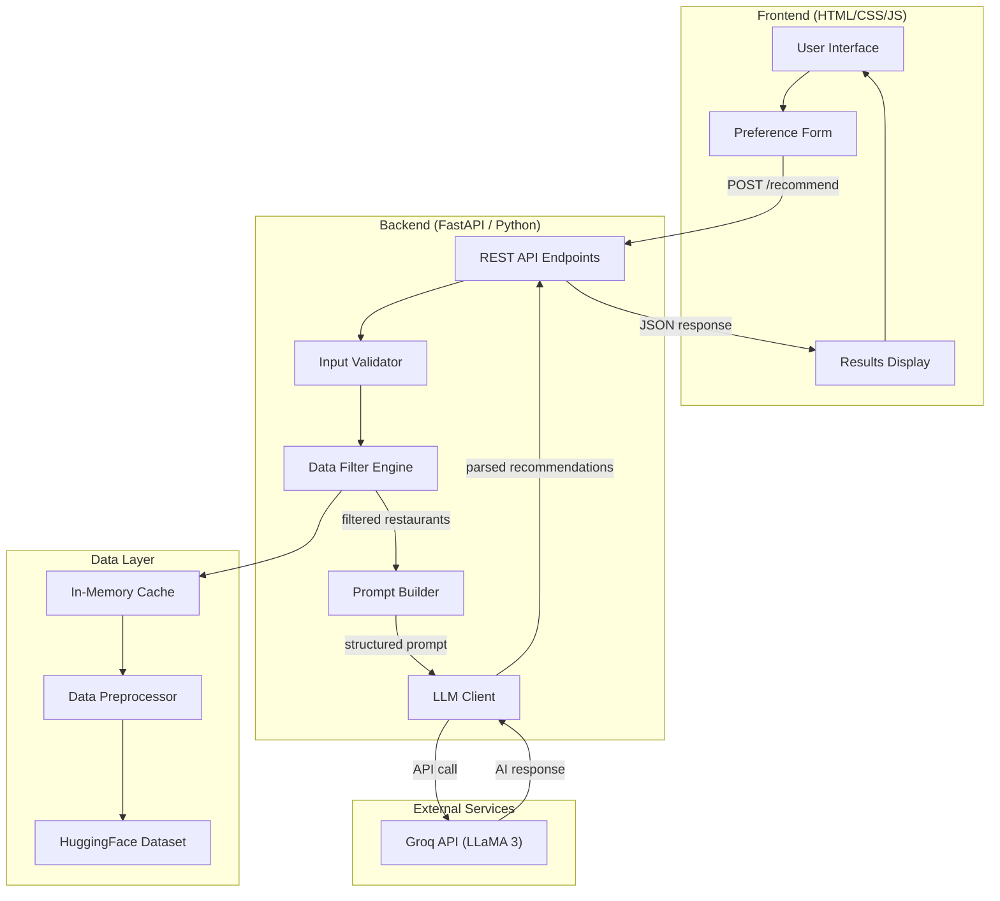
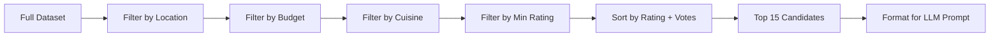
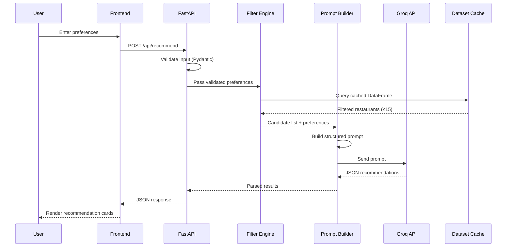

# Architecture: AI-Powered Restaurant Recommendation System

> Derived from [context.md](file:///Users/sanjeevjha/Desktop/Zomato%20Project/context.md)

---

## 1. High-Level Overview

The system is a **full-stack AI application** that combines a structured restaurant dataset (from Hugging Face) with a Large Language Model to deliver personalized, explainable restaurant recommendations through an interactive web interface.

```
┌─────────────────────────────────────────────────────────────────┐
│                        USER (Browser)                           │
│   Inputs: Location · Budget · Cuisine · Rating · Preferences    │
└──────────────────────────┬──────────────────────────────────────┘
                           │  HTTP / REST
                           ▼
┌─────────────────────────────────────────────────────────────────┐
│                     BACKEND API (FastAPI)                        │
│  ┌────────────┐  ┌────────────────┐  ┌───────────────────────┐  │
│  │  Input      │  │  Filtering &   │  │  LLM Recommendation  │  │
│  │  Validation │─▶│  Ranking Layer │─▶│  Engine               │  │
│  └────────────┘  └────────────────┘  └───────────────────────┘  │
│         │                │                      │               │
│         ▼                ▼                      ▼               │
│  ┌────────────┐  ┌────────────────┐  ┌───────────────────────┐  │
│  │  Pydantic   │  │  Pandas /      │  │  Groq API             │  │
│  │  Schemas    │  │  DataFrame Ops │  │  (Prompt Engineering) │  │
│  └────────────┘  └────────────────┘  └───────────────────────┘  │
└──────────────────────────┬──────────────────────────────────────┘
                           │
                           ▼
┌─────────────────────────────────────────────────────────────────┐
│                     DATA LAYER                                   │
│  ┌──────────────────────────────────────────────────────────┐   │
│  │  Zomato Dataset (HuggingFace)                            │   │
│  │  Source: ManikaSaini/zomato-restaurant-recommendation     │   │
│  │  Fields: name, location, cuisine, cost, rating, etc.     │   │
│  └──────────────────────────────────────────────────────────┘   │
└─────────────────────────────────────────────────────────────────┘
```

---

## 2. System Architecture Diagram



---

## 3. Component Breakdown

### 3.1 Data Ingestion Module

| Aspect           | Detail                                                                 |
| ---------------- | ---------------------------------------------------------------------- |
| **Source**        | HuggingFace — `ManikaSaini/zomato-restaurant-recommendation`           |
| **Library**      | `datasets` (HuggingFace) + `pandas`                                   |
| **Loading**      | One-time fetch on server startup, cached in memory as a DataFrame      |
| **Preprocessing** | Normalize column names, handle nulls, parse cost strings, standardize cuisines |

**Key fields to extract:**

| Field             | Type    | Example                   |
| ----------------- | ------- | ------------------------- |
| `restaurant_name` | string  | "Barbeque Nation"         |
| `location`        | string  | "Bangalore"               |
| `cuisines`        | string  | "North Indian, Chinese"   |
| `average_cost`    | float   | 1500.0                    |
| `aggregate_rating`| float   | 4.2                       |
| `votes`           | int     | 750                       |
| `has_online_delivery` | bool | True                     |
| `has_table_booking`   | bool | True                     |

**Preprocessing pipeline:**

```
Raw Dataset
    │
    ├── Drop rows with missing name/location/rating
    ├── Normalize cuisine strings (lowercase, strip whitespace)
    ├── Parse cost to numeric (remove currency symbols)
    ├── Bucket cost into: low (<500), medium (500–1500), high (>1500)
    ├── Filter out restaurants with 0 votes
    └── Cache cleaned DataFrame in memory
```

---

### 3.2 User Input Module

**Input Schema (Pydantic):**

```python
class UserPreferences(BaseModel):
    location: str                          # Required — city or area
    budget: Literal["low", "medium", "high"]  # Required
    cuisine: Optional[str] = None          # e.g., "Italian"
    min_rating: float = 3.5                # Default minimum
    additional_preferences: Optional[str] = None  # Free-text
```

**Validation rules:**
- `location` must match a known location in the dataset
- `budget` maps to cost ranges: low (<₹500), medium (₹500–₹1500), high (>₹1500)
- `min_rating` clamped between 0.0 and 5.0
- `cuisine` fuzzy-matched against known cuisines in the dataset

---

### 3.3 Integration / Filtering Layer

This is the bridge between structured data and the LLM. It performs deterministic filtering before handing off to the AI.

**Filter pipeline:**



**Why pre-filter?**
- Reduces token usage and cost by only sending relevant data to the LLM
- Ensures factual accuracy — the LLM can only recommend restaurants that actually exist in the dataset
- Faster response times

---

### 3.4 LLM Recommendation Engine

| Aspect         | Detail                                           |
| -------------- | ------------------------------------------------ |
| **Provider**   | Groq API (via `groq` Python SDK)                  |
| **Model**      | `llama-3.3-70b-versatile` (fast, high-quality)    |
| **Fallback**   | `llama-3.1-8b-instant` for simple/fast queries    |
| **Max Tokens** | 2048 (response)                                   |

**Prompt design strategy:**

```
SYSTEM:
  You are a restaurant recommendation expert. Given a list of restaurants 
  and user preferences, rank and recommend the top 5 options. For each, 
  provide a brief, compelling explanation of why it's a good fit.

USER:
  Preferences: {location}, {budget}, {cuisine}, {min_rating}, {additional}
  
  Available restaurants:
  1. Name: ... | Cuisine: ... | Rating: ... | Cost: ... | Votes: ...
  2. ...
  
  Recommend the top 5 restaurants. For each, explain WHY it matches the 
  user's preferences. Return as structured JSON.
```

**Response parsing:**
- LLM response is parsed as JSON
- Fallback to regex extraction if JSON parsing fails
- Each recommendation includes: name, cuisine, rating, cost, explanation

---

### 3.5 Output / Presentation Layer

**API Response Schema:**

```json
{
  "query": {
    "location": "Bangalore",
    "budget": "medium",
    "cuisine": "Italian",
    "min_rating": 4.0
  },
  "recommendations": [
    {
      "rank": 1,
      "restaurant_name": "Toscano",
      "cuisine": "Italian, Continental",
      "rating": 4.5,
      "estimated_cost": "₹1200 for two",
      "explanation": "Toscano is a top-rated Italian restaurant in Bangalore known for its authentic wood-fired pizzas and elegant ambiance. With a 4.5 rating and over 800 reviews, it perfectly fits your medium-budget Italian craving."
    }
  ],
  "total_matches": 12,
  "ai_summary": "Based on your preferences, Bangalore has 12 Italian restaurants in your budget range. Here are the top 5 picks..."
}
```

**Frontend display:**
- Card-based layout for each recommendation
- Visual rating stars
- Budget indicator (₹ / ₹₹ / ₹₹₹)
- Expandable AI explanation per card
- Summary banner at the top

---

## 4. Project Structure

```
Zomato Project/
├── docs/
│   ├── problem.txt              # Original problem statement
│   └── architecture.md          # This document
├── context.md                   # Project context reference
│
├── backend/
│   ├── main.py                  # FastAPI app entrypoint
│   ├── config.py                # Environment & API key config
│   ├── models/
│   │   ├── schemas.py           # Pydantic request/response models
│   │   └── __init__.py
│   ├── services/
│   │   ├── data_loader.py       # HuggingFace dataset loading & caching
│   │   ├── filter_engine.py     # Deterministic filtering logic
│   │   ├── prompt_builder.py    # LLM prompt construction
│   │   ├── llm_client.py        # Groq API integration
│   │   └── __init__.py
│   ├── utils/
│   │   ├── preprocessing.py     # Data cleaning utilities
│   │   └── __init__.py
│   ├── requirements.txt         # Python dependencies
│   └── .env.example             # Template for API keys
│
├── frontend/
│   ├── index.html               # Main HTML page
│   ├── css/
│   │   └── styles.css           # Styling
│   └── js/
│       └── app.js               # Frontend logic & API calls
│
└── README.md                    # Setup & usage guide
```

---

## 5. Data Flow (End-to-End)



---

## 6. API Endpoints

| Method | Endpoint              | Description                              |
| ------ | --------------------- | ---------------------------------------- |
| `GET`  | `/api/health`         | Health check                             |
| `GET`  | `/api/locations`      | List all available locations              |
| `GET`  | `/api/cuisines`       | List all available cuisines               |
| `POST` | `/api/recommend`      | Get AI-powered recommendations            |
| `GET`  | `/api/stats`          | Dataset statistics (count, avg rating)    |

---

## 7. Technology Stack

| Layer        | Technology                          | Justification                                    |
| ------------ | ----------------------------------- | ------------------------------------------------ |
| **Frontend** | HTML + CSS + Vanilla JS             | Lightweight, no build step required               |
| **Backend**  | Python 3.11+ / FastAPI              | Async support, auto-docs, Pydantic integration    |
| **Data**     | Pandas + HuggingFace `datasets`     | Efficient DataFrame ops, easy HF integration      |
| **LLM**      | Groq API (LLaMA 3.3 70B)           | Ultra-fast inference, free tier available, strong reasoning |
| **Hosting**  | Uvicorn (dev) / Gunicorn (prod)     | ASGI-compatible, production-ready                  |

**Key Python Dependencies:**

```
fastapi>=0.100.0
uvicorn>=0.23.0
pandas>=2.0.0
datasets>=2.14.0
groq>=0.4.0
pydantic>=2.0.0
python-dotenv>=1.0.0
```

---

## 8. Error Handling Strategy

| Scenario                    | Handling                                              |
| --------------------------- | ----------------------------------------------------- |
| No restaurants match filters | Return friendly message with relaxed filter suggestions |
| LLM API rate limit          | Retry with exponential backoff (max 3 attempts)        |
| LLM returns invalid JSON    | Fallback regex parser + graceful degradation            |
| LLM API key missing         | Fail fast at startup with clear error message           |
| Dataset load failure        | Retry once, then return 503 Service Unavailable         |
| Invalid user input          | Pydantic validation errors returned as 422              |

---

## 9. Performance Considerations

- **Dataset caching**: Load once at startup, keep in memory (~10–50 MB)
- **Pre-filtering**: Reduces LLM token usage by 90%+ (send 15 restaurants, not 10,000)
- **Async endpoints**: FastAPI's async I/O for non-blocking LLM calls
- **Response streaming** (future): Stream LLM output for faster perceived response time
- **Rate limiting**: Limit to 10 requests/minute per IP to control API costs

---

## 10. Security

- API keys stored in `.env` file, never committed to version control
- Input sanitization via Pydantic models
- CORS configured for frontend origin only
- No user data persistence (stateless)
- Rate limiting to prevent abuse

---

## 11. Future Enhancements

| Enhancement                  | Description                                                |
| ---------------------------- | ---------------------------------------------------------- |
| **Vector search**            | Use embeddings for semantic cuisine/preference matching     |
| **User history**             | Track past recommendations for personalization              |
| **Multi-turn conversation**  | Chat-style interface for refining preferences               |
| **Map integration**          | Show restaurant locations on an interactive map             |
| **Review summarization**     | Use LLM to summarize user reviews per restaurant            |
| **Multi-language support**   | Serve recommendations in Hindi, Tamil, etc.                 |
