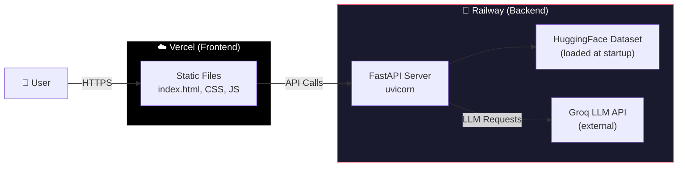

# 🚀 Deployment Plan — Zomato AI Recommendation System

> **Backend → [Railway](https://railway.app)**  
> **Frontend → [Vercel](https://vercel.com)**

---

## Architecture Overview



---

## Pre-Deployment Checklist

| # | Task | Status |
|---|------|--------|
| 1 | GitHub repository is up-to-date with latest code | ⬜ |
| 2 | `.gitignore` excludes `venv/`, `.env`, `__pycache__/` | ✅ |
| 3 | Backend runs locally with `uvicorn backend.main:app` | ⬜ |
| 4 | Frontend works against the local API | ⬜ |
| 5 | Groq API key is valid and has available quota | ⬜ |
| 6 | Railway account created at [railway.app](https://railway.app) | ⬜ |
| 7 | Vercel account created at [vercel.com](https://vercel.com) | ⬜ |

---

## Part 1: Backend Deployment on Railway

### Step 1.1 — Create Required Configuration Files

You need to add **three files** to the project root for Railway to build and run the backend correctly.

---

#### [NEW] `Procfile`

> **Location**: Project root (`Zomato Project/Procfile`)

```
web: uvicorn backend.main:app --host 0.0.0.0 --port $PORT
```

> [!NOTE]
> Railway injects the `$PORT` environment variable at runtime. The app **must** bind to this port, not a hardcoded one.

---

#### [NEW] `runtime.txt`

> **Location**: Project root (`Zomato Project/runtime.txt`)

```
python-3.11.9
```

> [!TIP]
> Specifying the Python version ensures consistent builds. Railway supports Python 3.8–3.12. Use 3.11.x for best compatibility with the `datasets` library.

---

#### [NEW] `requirements.txt` (Root Level)

> **Location**: Project root (`Zomato Project/requirements.txt`)

Railway looks for `requirements.txt` at the **project root** by default. Create a root-level file that references the backend dependencies:

```
fastapi>=0.100.0
uvicorn>=0.23.0
pandas>=2.0.0
datasets>=2.14.0
groq>=0.4.0
pydantic>=2.0.0
python-dotenv>=1.0.0
```

> [!IMPORTANT]
> This is a **copy** of `backend/requirements.txt` placed at the root. Railway's Python buildpack scans the repo root for this file. If it's only inside `backend/`, the build will fail.

---

### Step 1.2 — Update Backend for Production

#### [MODIFY] `backend/config.py`

The existing config already reads `PORT` from the environment, so no changes are needed. Railway will set:
- `PORT` — dynamically assigned port
- `GROQ_API_KEY` — your secret, configured in the Railway dashboard

#### [MODIFY] `backend/main.py` — CORS Update

For production, the wildcard CORS origin (`"*"`) should be replaced with your actual Vercel frontend URL. After deploying the frontend and obtaining its URL:

```python
app.add_middleware(
    CORSMiddleware,
    allow_origins=[
        "https://your-project.vercel.app",  # Production
        "http://localhost:5500",              # Local dev (Live Server)
        "http://localhost:8000",              # Local dev (served from FastAPI)
    ],
    allow_methods=["*"],
    allow_headers=["*"],
)
```

> [!WARNING]
> Keep `allow_origins=["*"]` during initial deployment for testing. Update it with your Vercel URL once the frontend is live. Using `"*"` in production is a security risk.

---

### Step 1.3 — Deploy to Railway

#### Option A: Deploy via Railway Dashboard (Recommended for first deploy)

1. Go to [railway.app](https://railway.app) and sign in (use GitHub OAuth)
2. Click **"New Project"** → **"Deploy from GitHub Repo"**
3. Select your **Zomato-Project** repository
4. Railway will auto-detect it as a Python project (via `requirements.txt` + `Procfile`)
5. Wait for the initial build to complete

#### Option B: Deploy via Railway CLI

```bash
# Install Railway CLI
npm install -g @railway/cli

# Login
railway login

# Initialize project (run from the project root)
railway init

# Link to your GitHub repo
railway link

# Deploy
railway up
```

---

### Step 1.4 — Configure Environment Variables on Railway

Navigate to your Railway project → **Variables** tab, and add:

| Variable | Value | Required |
|----------|-------|----------|
| `GROQ_API_KEY` | `gsk_xxxxxxxxxxxxxxxxxxxxx` | ✅ Yes |
| `GROQ_MODEL` | `llama-3.3-70b-versatile` | Optional (has default) |
| `GROQ_FALLBACK_MODEL` | `llama-3.1-8b-instant` | Optional (has default) |
| `MAX_TOKENS` | `2048` | Optional (has default) |
| `PORT` | *(auto-set by Railway)* | ❌ Don't set manually |
| `DEBUG` | `false` | Optional |
| `MAX_CANDIDATES` | `15` | Optional |

> [!CAUTION]
> **Never** commit your `GROQ_API_KEY` to the repository. Always use Railway's environment variable panel to inject secrets at runtime.

---

### Step 1.5 — Generate a Public URL

1. In your Railway project dashboard, go to **Settings** → **Networking**
2. Click **"Generate Domain"** to get a public URL like:
   ```
   https://zomato-project-production-xxxx.up.railway.app
   ```
3. **Save this URL** — you'll need it for the frontend configuration

---

### Step 1.6 — Verify Backend Deployment

Test these endpoints using your browser or `curl`:

```bash
# Health check
curl https://your-railway-url.up.railway.app/api/health
# Expected: {"status":"healthy"}

# Locations list
curl https://your-railway-url.up.railway.app/api/locations
# Expected: {"locations":["Bangalore","Delhi",...]}

# Dataset stats
curl https://your-railway-url.up.railway.app/api/stats
# Expected: {"total_restaurants":...,"total_locations":...}

# Swagger Docs (open in browser)
# https://your-railway-url.up.railway.app/docs
```

> [!NOTE]
> The **first request** after deployment may take 30–60 seconds because the HuggingFace dataset is loaded into memory at startup (lifespan event). Subsequent requests will be fast.

---

## Part 2: Frontend Deployment on Vercel

### Step 2.1 — Update API Base URL

#### [MODIFY] `frontend/js/app.js`

Replace the hardcoded localhost URL with your Railway production URL:

```javascript
// ── BEFORE (local development) ──
const API_BASE = 'http://localhost:8000';

// ── AFTER (production) ──
const API_BASE = 'https://your-railway-url.up.railway.app';
```

> [!TIP]
> **For a smarter approach**, use environment detection to switch automatically:
> ```javascript
> const API_BASE = window.location.hostname === 'localhost'
>   ? 'http://localhost:8000'
>   : 'https://your-railway-url.up.railway.app';
> ```
> This way, local development still works without code changes.

---

### Step 2.2 — Add Vercel Configuration

#### [NEW] `frontend/vercel.json`

> **Location**: `frontend/vercel.json`

```json
{
  "buildCommand": null,
  "outputDirectory": ".",
  "rewrites": [
    { "source": "/(.*)", "destination": "/index.html" }
  ],
  "headers": [
    {
      "source": "/(.*)",
      "headers": [
        { "key": "X-Content-Type-Options", "value": "nosniff" },
        { "key": "X-Frame-Options", "value": "DENY" },
        { "key": "Referrer-Policy", "value": "strict-origin-when-cross-origin" }
      ]
    },
    {
      "source": "/css/(.*)",
      "headers": [
        { "key": "Cache-Control", "value": "public, max-age=31536000, immutable" }
      ]
    },
    {
      "source": "/js/(.*)",
      "headers": [
        { "key": "Cache-Control", "value": "public, max-age=31536000, immutable" }
      ]
    }
  ]
}
```

> [!NOTE]
> Since this is a static site (HTML + CSS + JS, no build step), we set `buildCommand: null` and `outputDirectory: "."`. The `rewrites` rule ensures deep-links resolve to `index.html`. The `headers` add security and aggressive caching for static assets.

---

### Step 2.3 — Deploy to Vercel

#### Option A: Deploy via Vercel Dashboard (Recommended)

1. Go to [vercel.com](https://vercel.com) and sign in (use GitHub OAuth)
2. Click **"Add New Project"** → **"Import Git Repository"**
3. Select your **Zomato-Project** repository
4. **Critical**: Set the **Root Directory** to `frontend`

   ```
   Root Directory: frontend
   ```
5. Framework Preset: **Other** (since it's plain HTML/CSS/JS)
6. Build Command: *(leave empty)*
7. Output Directory: *(leave as `.`)*
8. Click **Deploy**

#### Option B: Deploy via Vercel CLI

```bash
# Install Vercel CLI
npm install -g vercel

# Navigate to the frontend directory
cd frontend

# Deploy (follow the interactive prompts)
vercel

# For production deployment
vercel --prod
```

---

### Step 2.4 — Verify Frontend Deployment

1. Open your Vercel URL (e.g., `https://zomato-project.vercel.app`)
2. Verify the page loads with the full design (dark theme, glassmorphism)
3. Check that the **Location** and **Cuisine** dropdowns populate (they call the Railway API)
4. Submit a recommendation request and verify cards render correctly

---

## Part 3: Post-Deployment Configuration

### Step 3.1 — Lock Down CORS

After confirming both deployments work:

1. Go to Railway → your project → **Variables**
2. *(Optional)* Add `FRONTEND_URL=https://your-project.vercel.app`
3. Update [backend/main.py](file:///Users/sanjeevjha/Desktop/Zomato%20Project/backend/main.py) CORS origins:

```python
import os

FRONTEND_URL = os.getenv("FRONTEND_URL", "http://localhost:5500")

app.add_middleware(
    CORSMiddleware,
    allow_origins=[
        FRONTEND_URL,
        "http://localhost:5500",
        "http://localhost:8000",
    ],
    allow_methods=["*"],
    allow_headers=["*"],
)
```

4. Push the change → Railway will auto-redeploy

---

### Step 3.2 — Set Up Custom Domains (Optional)

#### Vercel Custom Domain
1. Go to Vercel → Project → **Settings** → **Domains**
2. Add your domain (e.g., `epicure.yourdomain.com`)
3. Update DNS records as instructed by Vercel

#### Railway Custom Domain
1. Go to Railway → Project → **Settings** → **Networking** → **Custom Domain**
2. Add your domain (e.g., `api.epicure.yourdomain.com`)
3. Update DNS records as instructed by Railway

---

## Summary of New/Modified Files

| Action | File | Purpose |
|--------|------|---------|
| **[NEW]** | `Procfile` | Railway process entry point |
| **[NEW]** | `runtime.txt` | Python version for Railway |
| **[NEW]** | `requirements.txt` (root) | Dependencies for Railway buildpack |
| **[NEW]** | `frontend/vercel.json` | Vercel routing, caching, and security headers |
| **[MODIFY]** | `frontend/js/app.js` | Update `API_BASE` to Railway production URL |
| **[MODIFY]** | `backend/main.py` | Restrict CORS to Vercel frontend URL |

---

## Deployment Verification Checklist

| # | Check | Expected | Status |
|---|-------|----------|--------|
| 1 | Railway build succeeds | Green checkmark in dashboard | ⬜ |
| 2 | `GET /api/health` returns `{"status":"healthy"}` | 200 OK | ⬜ |
| 3 | `GET /api/locations` returns location list | 200 OK with JSON array | ⬜ |
| 4 | `GET /api/stats` returns dataset statistics | 200 OK with counts | ⬜ |
| 5 | Swagger docs load at `/docs` | Interactive API docs page | ⬜ |
| 6 | Vercel deployment succeeds | Green checkmark in dashboard | ⬜ |
| 7 | Frontend loads at Vercel URL | Full page with dark theme | ⬜ |
| 8 | Dropdowns populated from Railway API | Locations & cuisines load | ⬜ |
| 9 | Recommendation flow works end-to-end | Cards render with AI reasons | ⬜ |
| 10 | CORS locked to Vercel origin only | No errors in browser console | ⬜ |

---

## Troubleshooting

### Railway

| Issue | Solution |
|-------|----------|
| Build fails: "No requirements.txt found" | Ensure `requirements.txt` is at the **project root**, not just inside `backend/` |
| App crashes on startup | Check Railway logs. Common cause: missing `GROQ_API_KEY` env var |
| First request times out | HuggingFace dataset download can take ~30–60s on cold start. Railway may need 512MB+ RAM. Upgrade to Hobby plan if on free tier |
| Port binding error | Do **not** set `PORT` manually. Railway injects it automatically |

### Vercel

| Issue | Solution |
|-------|----------|
| 404 on page load | Ensure Root Directory is set to `frontend` in project settings |
| API calls fail (CORS) | Check Railway CORS `allow_origins` includes your Vercel URL (with `https://`) |
| Dropdowns empty | Open browser DevTools → Network tab. Check if API calls reach the Railway backend |
| Stale assets | Hard refresh (`Cmd+Shift+R`) or clear Vercel cache in dashboard |

---

## Cost Estimates

| Service | Free Tier | Limits | Paid |
|---------|-----------|--------|------|
| **Railway** | Trial credits (~$5) | 500 hours/month, 512MB RAM | Hobby: $5/month + usage |
| **Vercel** | Hobby (free) | 100GB bandwidth, 100 deployments/day | Pro: $20/month |
| **Groq** | Free tier | Rate-limited (30 RPM) | Pay-as-you-go |

> [!IMPORTANT]
> Railway's free trial has limited credits. For sustained hosting, upgrade to the **Hobby plan** ($5/month). The HuggingFace dataset load at startup uses ~200–400MB RAM, so ensure your Railway instance has at least 512MB available.
