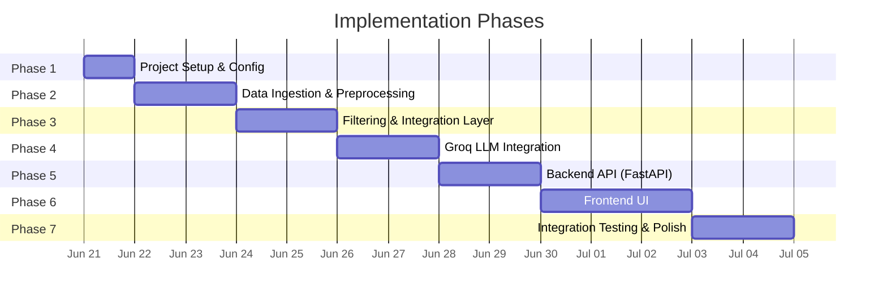
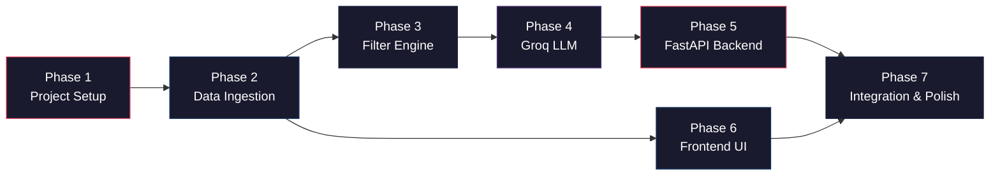

# Implementation Plan: AI-Powered Restaurant Recommendation System

> Derived from [architecture.md](file:///Users/sanjeevjha/Desktop/Zomato%20Project/docs/architecture.md) and [context.md](file:///Users/sanjeevjha/Desktop/Zomato%20Project/context.md)

---

## Phase Overview



---

## Phase 1: Project Setup & Configuration

**Goal**: Scaffold the project structure and install all dependencies.

**Duration**: ~0.5 day

### Tasks

| # | Task | File(s) | Status |
|---|------|---------|--------|
| 1.1 | Create project directory structure | All folders | ⬜ |
| 1.2 | Initialize Python virtual environment | `venv/` | ⬜ |
| 1.3 | Create `requirements.txt` with all dependencies | `backend/requirements.txt` | ⬜ |
| 1.4 | Set up environment config and `.env` template | `backend/config.py`, `backend/.env.example` | ⬜ |
| 1.5 | Create `__init__.py` files for all packages | `backend/models/`, `backend/services/`, `backend/utils/` | ⬜ |
| 1.6 | Add `.gitignore` | `.gitignore` | ⬜ |

### Directory Structure to Create

```
Zomato Project/
├── backend/
│   ├── models/
│   │   └── __init__.py
│   ├── services/
│   │   └── __init__.py
│   ├── utils/
│   │   └── __init__.py
│   ├── main.py              (placeholder)
│   ├── config.py
│   ├── requirements.txt
│   └── .env.example
├── frontend/
│   ├── css/
│   ├── js/
│   └── index.html           (placeholder)
├── docs/
└── README.md
```

### `requirements.txt`

```
fastapi>=0.100.0
uvicorn>=0.23.0
pandas>=2.0.0
datasets>=2.14.0
groq>=0.4.0
pydantic>=2.0.0
python-dotenv>=1.0.0
```

### `config.py` — Key Implementation

```python
import os
from dotenv import load_dotenv

load_dotenv()

class Settings:
    GROQ_API_KEY: str = os.getenv("GROQ_API_KEY", "")
    GROQ_MODEL: str = os.getenv("GROQ_MODEL", "llama-3.3-70b-versatile")
    GROQ_FALLBACK_MODEL: str = os.getenv("GROQ_FALLBACK_MODEL", "llama-3.1-8b-instant")
    MAX_TOKENS: int = int(os.getenv("MAX_TOKENS", "2048"))
    DATASET_NAME: str = "ManikaSaini/zomato-restaurant-recommendation"

settings = Settings()
```

### `.env.example`

```
GROQ_API_KEY=your_groq_api_key_here
GROQ_MODEL=llama-3.3-70b-versatile
GROQ_FALLBACK_MODEL=llama-3.1-8b-instant
MAX_TOKENS=2048
```

### Deliverables
- ✅ Project skeleton with all directories
- ✅ Virtual environment with dependencies installed
- ✅ Config system reading from `.env`

---

## Phase 2: Data Ingestion & Preprocessing

**Goal**: Load the Zomato dataset from HuggingFace, clean it, and cache it in memory.

**Duration**: ~1–2 days

### Tasks

| # | Task | File(s) | Status |
|---|------|---------|--------|
| 2.1 | Implement HuggingFace dataset loader | `backend/services/data_loader.py` | ⬜ |
| 2.2 | Implement preprocessing pipeline | `backend/utils/preprocessing.py` | ⬜ |
| 2.3 | Add budget bucketing logic (low/medium/high) | `backend/utils/preprocessing.py` | ⬜ |
| 2.4 | Add in-memory caching mechanism | `backend/services/data_loader.py` | ⬜ |
| 2.5 | Write unit tests for data loading | `backend/tests/test_data_loader.py` | ⬜ |

### `data_loader.py` — Key Implementation

```python
from datasets import load_dataset
import pandas as pd
from backend.utils.preprocessing import preprocess_dataframe
from backend.config import settings

_cached_df: pd.DataFrame | None = None

def load_restaurant_data() -> pd.DataFrame:
    """Load and cache the Zomato dataset from HuggingFace."""
    global _cached_df
    if _cached_df is not None:
        return _cached_df

    dataset = load_dataset(settings.DATASET_NAME, split="train")
    df = dataset.to_pandas()
    _cached_df = preprocess_dataframe(df)
    return _cached_df

def get_unique_locations() -> list[str]:
    """Return sorted list of all unique locations."""
    df = load_restaurant_data()
    return sorted(df["location"].unique().tolist())

def get_unique_cuisines() -> list[str]:
    """Return sorted list of all unique cuisines."""
    df = load_restaurant_data()
    # Explode multi-cuisine entries
    all_cuisines = df["cuisines"].str.split(",").explode().str.strip().unique()
    return sorted(all_cuisines.tolist())
```

### `preprocessing.py` — Key Implementation

```python
import pandas as pd

BUDGET_THRESHOLDS = {
    "low": (0, 500),
    "medium": (500, 1500),
    "high": (1500, float("inf")),
}

def preprocess_dataframe(df: pd.DataFrame) -> pd.DataFrame:
    """Clean and standardize the raw Zomato dataset."""
    # 1. Drop rows with missing critical fields
    df = df.dropna(subset=["name", "location", "aggregate_rating"])

    # 2. Normalize cuisine strings
    df["cuisines"] = df["cuisines"].fillna("").str.strip().str.lower()

    # 3. Parse cost to numeric
    df["average_cost_for_two"] = pd.to_numeric(
        df["average_cost_for_two"].astype(str).str.replace(r"[^\d.]", "", regex=True),
        errors="coerce"
    ).fillna(0)

    # 4. Bucket cost into categories
    df["budget_category"] = df["average_cost_for_two"].apply(_categorize_budget)

    # 5. Filter out restaurants with 0 votes
    df = df[df["votes"] > 0]

    # 6. Normalize location
    df["location"] = df["location"].str.strip().str.title()

    return df.reset_index(drop=True)

def _categorize_budget(cost: float) -> str:
    for category, (low, high) in BUDGET_THRESHOLDS.items():
        if low <= cost < high:
            return category
    return "high"
```

### Verification
- Print DataFrame shape, column dtypes, sample rows after preprocessing
- Verify budget bucketing distribution
- Confirm no nulls in critical columns

### Deliverables
- ✅ Working dataset loader with caching
- ✅ Preprocessing pipeline (nulls, normalization, bucketing)
- ✅ Helper functions for locations/cuisines lists

---

## Phase 3: Filtering & Integration Layer

**Goal**: Build the deterministic filter engine that narrows down candidates before sending them to the LLM.

**Duration**: ~1–2 days

### Tasks

| # | Task | File(s) | Status |
|---|------|---------|--------|
| 3.1 | Define Pydantic request/response schemas | `backend/models/schemas.py` | ⬜ |
| 3.2 | Implement multi-criteria filter engine | `backend/services/filter_engine.py` | ⬜ |
| 3.3 | Add fuzzy cuisine matching | `backend/services/filter_engine.py` | ⬜ |
| 3.4 | Write unit tests for filtering | `backend/tests/test_filter_engine.py` | ⬜ |

### `schemas.py` — Key Implementation

```python
from pydantic import BaseModel, Field
from typing import Optional, Literal

class UserPreferences(BaseModel):
    location: str = Field(..., description="City or area name")
    budget: Literal["low", "medium", "high"] = Field(..., description="Budget category")
    cuisine: Optional[str] = Field(None, description="Preferred cuisine type")
    min_rating: float = Field(3.5, ge=0.0, le=5.0, description="Minimum rating")
    additional_preferences: Optional[str] = Field(None, description="Extra preferences")

class RestaurantRecommendation(BaseModel):
    rank: int
    restaurant_name: str
    cuisine: str
    rating: float
    estimated_cost: str
    explanation: str

class RecommendationResponse(BaseModel):
    query: UserPreferences
    recommendations: list[RestaurantRecommendation]
    total_matches: int
    ai_summary: str
```

### `filter_engine.py` — Key Implementation

```python
import pandas as pd
from backend.models.schemas import UserPreferences

MAX_CANDIDATES = 15

def filter_restaurants(df: pd.DataFrame, prefs: UserPreferences) -> pd.DataFrame:
    """Apply cascading filters based on user preferences."""
    filtered = df.copy()

    # 1. Filter by location (case-insensitive)
    filtered = filtered[
        filtered["location"].str.lower() == prefs.location.lower()
    ]

    # 2. Filter by budget category
    filtered = filtered[filtered["budget_category"] == prefs.budget]

    # 3. Filter by cuisine (partial match)
    if prefs.cuisine:
        filtered = filtered[
            filtered["cuisines"].str.contains(prefs.cuisine.lower(), na=False)
        ]

    # 4. Filter by minimum rating
    filtered = filtered[filtered["aggregate_rating"] >= prefs.min_rating]

    # 5. Sort by rating (desc) then votes (desc)
    filtered = filtered.sort_values(
        by=["aggregate_rating", "votes"],
        ascending=[False, False]
    )

    # 6. Return top N candidates
    return filtered.head(MAX_CANDIDATES)
```

### Filter Pipeline Flow

```
User Input → Location Filter → Budget Filter → Cuisine Filter → Rating Filter → Sort → Top 15
                                                                                          │
                                                                              Format for LLM Prompt
```

### Deliverables
- ✅ Pydantic models for request/response
- ✅ Cascading filter engine with configurable candidate limit
- ✅ Edge case handling (no results, relaxed filters)

---

## Phase 4: Groq LLM Integration

**Goal**: Connect to Groq API, build the prompt, and parse structured recommendations.

**Duration**: ~2 days

### Tasks

| # | Task | File(s) | Status |
|---|------|---------|--------|
| 4.1 | Implement Groq API client wrapper | `backend/services/llm_client.py` | ⬜ |
| 4.2 | Design and implement prompt builder | `backend/services/prompt_builder.py` | ⬜ |
| 4.3 | Implement JSON response parser with fallback | `backend/services/llm_client.py` | ⬜ |
| 4.4 | Add retry logic with exponential backoff | `backend/services/llm_client.py` | ⬜ |
| 4.5 | Test with sample data end-to-end | Manual testing | ⬜ |

### `prompt_builder.py` — Key Implementation

```python
import pandas as pd
from backend.models.schemas import UserPreferences

def build_recommendation_prompt(
    prefs: UserPreferences,
    candidates: pd.DataFrame
) -> tuple[str, str]:
    """Build system and user prompts for the LLM."""

    system_prompt = """You are an expert restaurant recommendation assistant. 
Given a list of restaurants and user preferences, analyze each option and 
recommend the top 5 restaurants. For each recommendation, provide a clear, 
compelling explanation of why it's a great fit for the user.

IMPORTANT: Return your response as valid JSON with this exact structure:
{
  "recommendations": [
    {
      "rank": 1,
      "restaurant_name": "...",
      "cuisine": "...",
      "rating": 4.5,
      "estimated_cost": "₹... for two",
      "explanation": "..."
    }
  ],
  "summary": "A brief overall summary of the recommendations"
}"""

    # Format restaurant data as a numbered list
    restaurant_list = []
    for i, (_, row) in enumerate(candidates.iterrows(), 1):
        restaurant_list.append(
            f"{i}. {row['name']} | Cuisine: {row['cuisines']} | "
            f"Rating: {row['aggregate_rating']}/5 | "
            f"Cost: ₹{row['average_cost_for_two']} for two | "
            f"Votes: {row['votes']}"
        )

    restaurants_text = "\n".join(restaurant_list)

    user_prompt = f"""User Preferences:
- Location: {prefs.location}
- Budget: {prefs.budget}
- Cuisine: {prefs.cuisine or "Any"}
- Minimum Rating: {prefs.min_rating}
- Additional: {prefs.additional_preferences or "None"}

Available Restaurants:
{restaurants_text}

Please recommend the top 5 restaurants from this list and explain your reasoning."""

    return system_prompt, user_prompt
```

### `llm_client.py` — Key Implementation

```python
import json
import time
from groq import Groq
from backend.config import settings
from backend.models.schemas import RestaurantRecommendation

MAX_RETRIES = 3

class GroqClient:
    def __init__(self):
        if not settings.GROQ_API_KEY:
            raise ValueError("GROQ_API_KEY is not set in environment")
        self.client = Groq(api_key=settings.GROQ_API_KEY)

    def get_recommendations(
        self,
        system_prompt: str,
        user_prompt: str
    ) -> dict:
        """Call Groq API with retry logic and parse the response."""
        for attempt in range(MAX_RETRIES):
            try:
                response = self.client.chat.completions.create(
                    model=settings.GROQ_MODEL,
                    messages=[
                        {"role": "system", "content": system_prompt},
                        {"role": "user", "content": user_prompt},
                    ],
                    temperature=0.7,
                    max_tokens=settings.MAX_TOKENS,
                    response_format={"type": "json_object"},
                )

                content = response.choices[0].message.content
                return self._parse_response(content)

            except Exception as e:
                if attempt < MAX_RETRIES - 1:
                    wait = 2 ** attempt  # Exponential backoff
                    time.sleep(wait)
                else:
                    raise RuntimeError(f"Groq API failed after {MAX_RETRIES} retries: {e}")

    def _parse_response(self, content: str) -> dict:
        """Parse LLM response as JSON with regex fallback."""
        try:
            return json.loads(content)
        except json.JSONDecodeError:
            # Fallback: try to extract JSON block from response
            import re
            match = re.search(r"\{.*\}", content, re.DOTALL)
            if match:
                return json.loads(match.group())
            raise ValueError("Could not parse LLM response as JSON")

groq_client = GroqClient()
```

### Deliverables
- ✅ Groq API client with retry + exponential backoff
- ✅ Prompt builder producing system + user messages
- ✅ JSON parser with regex fallback
- ✅ Validated end-to-end with sample queries

---

## Phase 5: Backend API (FastAPI)

**Goal**: Wire everything together into REST endpoints.

**Duration**: ~1–2 days

### Tasks

| # | Task | File(s) | Status |
|---|------|---------|--------|
| 5.1 | Create FastAPI app with CORS and lifespan | `backend/main.py` | ⬜ |
| 5.2 | Implement `POST /api/recommend` endpoint | `backend/main.py` | ⬜ |
| 5.3 | Implement `GET /api/locations` endpoint | `backend/main.py` | ⬜ |
| 5.4 | Implement `GET /api/cuisines` endpoint | `backend/main.py` | ⬜ |
| 5.5 | Implement `GET /api/health` and `GET /api/stats` | `backend/main.py` | ⬜ |
| 5.6 | Add error handling middleware | `backend/main.py` | ⬜ |
| 5.7 | Test all endpoints via Swagger UI | Manual testing | ⬜ |

### `main.py` — Key Implementation

```python
from contextlib import asynccontextmanager
from fastapi import FastAPI, HTTPException
from fastapi.middleware.cors import CORSMiddleware
from backend.models.schemas import UserPreferences, RecommendationResponse
from backend.services.data_loader import load_restaurant_data, get_unique_locations, get_unique_cuisines
from backend.services.filter_engine import filter_restaurants
from backend.services.prompt_builder import build_recommendation_prompt
from backend.services.llm_client import groq_client

@asynccontextmanager
async def lifespan(app: FastAPI):
    # Startup: preload dataset
    load_restaurant_data()
    yield

app = FastAPI(
    title="Zomato AI Recommendation API",
    version="1.0.0",
    lifespan=lifespan,
)

app.add_middleware(
    CORSMiddleware,
    allow_origins=["*"],
    allow_methods=["*"],
    allow_headers=["*"],
)

@app.get("/api/health")
async def health_check():
    return {"status": "healthy"}

@app.get("/api/locations")
async def list_locations():
    return {"locations": get_unique_locations()}

@app.get("/api/cuisines")
async def list_cuisines():
    return {"cuisines": get_unique_cuisines()}

@app.get("/api/stats")
async def dataset_stats():
    df = load_restaurant_data()
    return {
        "total_restaurants": len(df),
        "total_locations": df["location"].nunique(),
        "total_cuisines": df["cuisines"].nunique(),
        "average_rating": round(df["aggregate_rating"].mean(), 2),
    }

@app.post("/api/recommend", response_model=RecommendationResponse)
async def recommend(prefs: UserPreferences):
    df = load_restaurant_data()
    candidates = filter_restaurants(df, prefs)

    if candidates.empty:
        raise HTTPException(
            status_code=404,
            detail="No restaurants found matching your preferences. Try relaxing your filters."
        )

    system_prompt, user_prompt = build_recommendation_prompt(prefs, candidates)
    result = groq_client.get_recommendations(system_prompt, user_prompt)

    return RecommendationResponse(
        query=prefs,
        recommendations=result.get("recommendations", []),
        total_matches=len(candidates),
        ai_summary=result.get("summary", ""),
    )
```

### API Testing Checklist

| Endpoint | Test | Expected |
|----------|------|----------|
| `GET /api/health` | Hit endpoint | `{"status": "healthy"}` |
| `GET /api/locations` | Hit endpoint | List of city names |
| `GET /api/cuisines` | Hit endpoint | List of cuisine types |
| `GET /api/stats` | Hit endpoint | Restaurant count, avg rating |
| `POST /api/recommend` | Valid request | AI recommendations JSON |
| `POST /api/recommend` | Invalid location | 404 with helpful message |
| `POST /api/recommend` | Missing fields | 422 validation error |

### Deliverables
- ✅ All 5 endpoints working
- ✅ CORS enabled for frontend
- ✅ Dataset preloaded at startup
- ✅ Swagger docs at `/docs`

---

## Phase 6: Frontend UI

**Goal**: Build a visually polished, responsive web interface.

**Duration**: ~2–3 days

### Tasks

| # | Task | File(s) | Status |
|---|------|---------|--------|
| 6.1 | Create HTML structure with semantic elements | `frontend/index.html` | ⬜ |
| 6.2 | Design CSS with dark theme, gradients, animations | `frontend/css/styles.css` | ⬜ |
| 6.3 | Build preference form (location, budget, cuisine, rating) | `frontend/index.html` | ⬜ |
| 6.4 | Populate dropdowns from API (`/locations`, `/cuisines`) | `frontend/js/app.js` | ⬜ |
| 6.5 | Implement API call to `/api/recommend` | `frontend/js/app.js` | ⬜ |
| 6.6 | Build recommendation card components | `frontend/js/app.js` | ⬜ |
| 6.7 | Add loading states and error handling | `frontend/js/app.js` | ⬜ |
| 6.8 | Add responsive design for mobile/tablet | `frontend/css/styles.css` | ⬜ |

### UI Layout

```
┌──────────────────────────────────────────────────────┐
│  🍽️  Zomato AI Restaurant Recommender                │
│  ─────────────────────────────────────────────────── │
│                                                      │
│  ┌─ Preference Form ──────────────────────────────┐  │
│  │  📍 Location: [  Dropdown  ▾]                  │  │
│  │  💰 Budget:   [Low] [Medium] [High]            │  │
│  │  🍕 Cuisine:  [  Dropdown  ▾]                  │  │
│  │  ⭐ Min Rating: [━━━━━●━━━━━] 3.5              │  │
│  │  📝 Additional: [  Text input  ]               │  │
│  │                                                │  │
│  │           [ 🔍 Get Recommendations ]           │  │
│  └────────────────────────────────────────────────┘  │
│                                                      │
│  ┌─ AI Summary ───────────────────────────────────┐  │
│  │  "Found 12 Italian restaurants in Bangalore..." │  │
│  └────────────────────────────────────────────────┘  │
│                                                      │
│  ┌─ Card 1 ──────┐  ┌─ Card 2 ──────┐              │
│  │ Toscano        │  │ Little Italy   │              │
│  │ ⭐ 4.5  ₹₹    │  │ ⭐ 4.3  ₹₹    │              │
│  │ Italian        │  │ Italian        │              │
│  │ ₹1200 for two  │  │ ₹1000 for two  │              │
│  │ [AI Reason ▾]  │  │ [AI Reason ▾]  │              │
│  └────────────────┘  └────────────────┘              │
│                                                      │
│  ┌─ Card 3 ──────┐  ┌─ Card 4 ──────┐              │
│  │ ...            │  │ ...            │              │
│  └────────────────┘  └────────────────┘              │
└──────────────────────────────────────────────────────┘
```

### Design Specifications

| Element | Style |
|---------|-------|
| **Theme** | Dark mode with gradient accents |
| **Font** | Google Fonts — `Inter` or `Outfit` |
| **Cards** | Glassmorphism effect with subtle borders |
| **Buttons** | Gradient fill with hover glow animation |
| **Rating** | Star icons (filled/empty) with gold color |
| **Budget** | Toggle buttons with active state highlight |
| **Loading** | Skeleton cards + pulsing animation |
| **Transitions** | Cards fade-in with staggered delay |

### Deliverables
- ✅ Fully functional preference form
- ✅ Dynamic dropdowns populated from API
- ✅ Recommendation cards with AI explanations
- ✅ Loading, empty, and error states
- ✅ Responsive across desktop, tablet, mobile

---

## Phase 7: Integration Testing & Polish

**Goal**: End-to-end testing, bug fixes, and final polish.

**Duration**: ~1–2 days

### Tasks

| # | Task | File(s) | Status |
|---|------|---------|--------|
| 7.1 | Full end-to-end test: form → API → LLM → display | All | ⬜ |
| 7.2 | Test edge cases (no results, API timeout, bad input) | All | ⬜ |
| 7.3 | Test across multiple locations and cuisines | Manual | ⬜ |
| 7.4 | Performance check (response time < 5s) | Manual | ⬜ |
| 7.5 | Mobile responsiveness testing | Manual | ⬜ |
| 7.6 | Write README with setup instructions | `README.md` | ⬜ |
| 7.7 | Add `.gitignore` for Python/Node artifacts | `.gitignore` | ⬜ |
| 7.8 | Final code cleanup and documentation | All | ⬜ |

### README Template

```markdown
# 🍽️ Zomato AI Restaurant Recommender

AI-powered restaurant recommendation system using Groq LLM.

## Setup

1. Clone the repository
2. Create virtual environment: `python -m venv venv && source venv/bin/activate`
3. Install dependencies: `pip install -r backend/requirements.txt`
4. Copy `.env.example` to `.env` and add your Groq API key
5. Run the server: `uvicorn backend.main:app --reload`
6. Open `frontend/index.html` in your browser

## API Documentation

Visit `http://localhost:8000/docs` for interactive Swagger UI.
```

### Test Scenarios

| Scenario | Input | Expected Output |
|----------|-------|-----------------|
| Happy path | Location: Bangalore, Budget: Medium, Cuisine: Italian, Rating: 4.0 | 5 Italian restaurant cards with explanations |
| No cuisine filter | Location: Delhi, Budget: Low, Rating: 3.0 | 5 mixed-cuisine recommendations |
| No results | Location: "NonExistentCity", Budget: High | Friendly "no results" message |
| High rating filter | Rating: 4.8, any location | Few or no results with suggestion to lower threshold |
| Free-text preferences | Additional: "rooftop seating, date night" | Recommendations influenced by preferences |

### Deliverables
- ✅ All happy-path and edge-case tests passing
- ✅ Response time under 5 seconds
- ✅ README with full setup guide
- ✅ Clean, documented codebase

---

## Summary: Phase Dependency Map



| Phase | Focus | Key Output |
|-------|-------|------------|
| **Phase 1** | Project Setup | Scaffolded project, dependencies, config |
| **Phase 2** | Data Ingestion | Cleaned DataFrame cached in memory |
| **Phase 3** | Filtering | Pydantic schemas + multi-criteria filter engine |
| **Phase 4** | Groq LLM | Prompt builder + Groq client with retry logic |
| **Phase 5** | Backend API | 5 REST endpoints, Swagger docs |
| **Phase 6** | Frontend UI | Polished dark-theme UI with cards |
| **Phase 7** | Integration | E2E tested, documented, production-ready |
