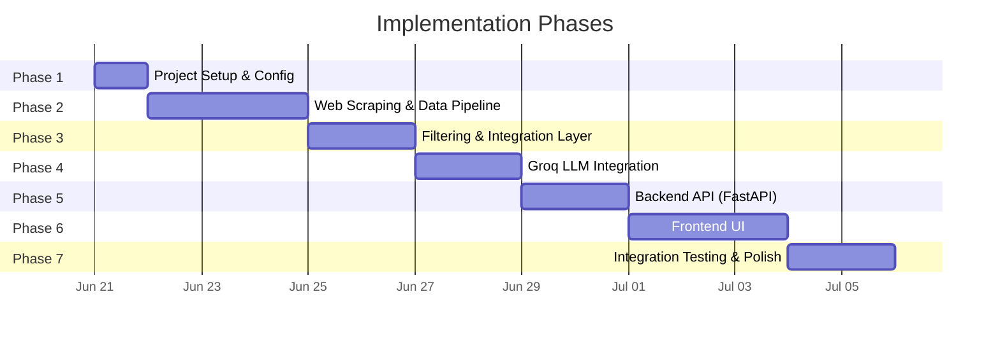

# Implementation Plan: AI-Powered Restaurant Recommendation System

> Derived from [architecture.md](file:///Users/sanjeevjha/Desktop/Zomato%20Project/docs/architecture.md) and [context.md](file:///Users/sanjeevjha/Desktop/Zomato%20Project/context.md)

> [!IMPORTANT]
> **Data Source Change**: This plan now scrapes **live data directly from Zomato** (`https://www.zomato.com/{city}/restaurants`) instead of using the HuggingFace dataset. This gives us real-time, up-to-date restaurant data with images and URLs.

---

## Phase Overview



---

## Phase 1: Project Setup & Configuration

**Goal**: Scaffold the project structure and install all dependencies.

**Duration**: ~0.5 day

### Tasks

| # | Task | File(s) | Status |
|---|------|---------|--------|
| 1.1 | Create project directory structure | All folders | ⬜ |
| 1.2 | Initialize Python virtual environment | `venv/` | ⬜ |
| 1.3 | Create `requirements.txt` with all dependencies | `backend/requirements.txt` | ⬜ |
| 1.4 | Set up environment config and `.env` template | `backend/config.py`, `backend/.env.example` | ⬜ |
| 1.5 | Create `__init__.py` files for all packages | `backend/models/`, `backend/services/`, `backend/utils/` | ⬜ |
| 1.6 | Add `.gitignore` | `.gitignore` | ⬜ |

### Directory Structure to Create

```
Zomato Project/
├── backend/
│   ├── models/
│   │   └── __init__.py
│   ├── services/
│   │   └── __init__.py
│   ├── utils/
│   │   └── __init__.py
│   ├── main.py              (placeholder)
│   ├── config.py
│   ├── requirements.txt
│   └── .env.example
├── frontend/
│   ├── css/
│   ├── js/
│   └── index.html           (placeholder)
├── data/                     (scraped data cache)
│   └── .gitkeep
├── docs/
└── README.md
```

### `requirements.txt`

> [!WARNING]
> **Changed from previous plan**: Replaced `datasets>=2.14.0` (HuggingFace) with `beautifulsoup4`, `requests`, `lxml`, and `playwright` for web scraping from Zomato.

```
fastapi>=0.100.0
uvicorn>=0.23.0
pandas>=2.0.0
beautifulsoup4>=4.12.0
requests>=2.31.0
lxml>=4.9.0
playwright>=1.40.0
groq>=0.4.0
pydantic>=2.0.0
python-dotenv>=1.0.0
aiohttp>=3.9.0
```

### `config.py` — Key Implementation

```python
import os
from dotenv import load_dotenv

load_dotenv()

class Settings:
    GROQ_API_KEY: str = os.getenv("GROQ_API_KEY", "")
    GROQ_MODEL: str = os.getenv("GROQ_MODEL", "llama-3.3-70b-versatile")
    GROQ_FALLBACK_MODEL: str = os.getenv("GROQ_FALLBACK_MODEL", "llama-3.1-8b-instant")
    MAX_TOKENS: int = int(os.getenv("MAX_TOKENS", "2048"))

    # Zomato scraping config
    ZOMATO_BASE_URL: str = "https://www.zomato.com"
    SUPPORTED_CITIES: list[str] = [
        "mumbai", "delhi-ncr", "bangalore", "hyderabad",
        "ahmedabad", "chennai", "kolkata", "pune",
        "jaipur", "lucknow", "chandigarh", "goa",
    ]
    SCRAPE_CACHE_DIR: str = os.getenv("SCRAPE_CACHE_DIR", "data/")
    SCRAPE_CACHE_TTL_HOURS: int = int(os.getenv("SCRAPE_CACHE_TTL_HOURS", "6"))
    MAX_PAGES_PER_CITY: int = int(os.getenv("MAX_PAGES_PER_CITY", "5"))

settings = Settings()
```

### `.env.example`

```
GROQ_API_KEY=your_groq_api_key_here
GROQ_MODEL=llama-3.3-70b-versatile
GROQ_FALLBACK_MODEL=llama-3.1-8b-instant
MAX_TOKENS=2048
SCRAPE_CACHE_DIR=data/
SCRAPE_CACHE_TTL_HOURS=6
MAX_PAGES_PER_CITY=5
```

### Deliverables
- ✅ Project skeleton with all directories
- ✅ Virtual environment with dependencies installed
- ✅ Config system reading from `.env`

---

## Phase 2: Web Scraping & Data Pipeline (Live Zomato Data)

> [!IMPORTANT]
> **Major change from previous plan**: Instead of loading a static HuggingFace dataset, we now scrape live restaurant data directly from `https://www.zomato.com/{city}/restaurants`. This provides real-time data including current ratings, reviews, images, and restaurant URLs.

**Goal**: Scrape restaurant data from Zomato's website, parse it, cache it locally, and serve a clean DataFrame.

**Duration**: ~2–3 days

### Data Source Strategy

Zomato's restaurant listing pages embed **JSON-LD structured data** (`application/ld+json`) in the HTML, containing an `ItemList` with restaurant entries. Each entry includes:

| Field | JSON-LD Path | Example |
|-------|-------------|---------|
| `name` | `item.name` | `"Tanatan"` |
| `image` | `item.image` | `"https://b.zmtcdn.com/data/pictures/..."` |
| `rating` | `item.aggregateRating.ratingValue` | `4.4` |
| `review_count` | `item.aggregateRating.reviewCount` | `14` |
| `url` | `item.url` | `"/mumbai/tanatan-dadar-shivaji-park/info"` |
| `address` | `item.address.streetAddress` | `"Shop 8, T/13, 121, Ground Floor..."` |
| `cuisines` | `item.servesCuisine` | `"North Indian, Mughlai, South Indian"` |

**Scraping approach (two-tier)**:

1. **Tier 1 — JSON-LD Extraction (Primary)**: Parse structured data from `<script type="application/ld+json">` tags. Fast, reliable, and doesn't require JavaScript rendering.
2. **Tier 2 — Playwright Deep Scrape (Fallback/Enrichment)**: For additional fields (cost for two, online delivery, table booking) that are only in the dynamic HTML, use Playwright to render pages and extract data from restaurant detail pages.

### Tasks

| # | Task | File(s) | Status |
|---|------|---------|--------|
| 2.1 | Implement Zomato page scraper (JSON-LD extraction) | `backend/services/scraper.py` | ⬜ |
| 2.2 | Implement pagination handler (multi-page scraping) | `backend/services/scraper.py` | ⬜ |
| 2.3 | Implement restaurant detail page scraper (cost, features) | `backend/services/scraper.py` | ⬜ |
| 2.4 | Implement local file caching (JSON) with TTL | `backend/services/data_cache.py` | ⬜ |
| 2.5 | Implement preprocessing pipeline | `backend/utils/preprocessing.py` | ⬜ |
| 2.6 | Add budget bucketing logic (low/medium/high) | `backend/utils/preprocessing.py` | ⬜ |
| 2.7 | Implement unified data loader with cache-first strategy | `backend/services/data_loader.py` | ⬜ |
| 2.8 | Add multi-city support | `backend/services/scraper.py` | ⬜ |
| 2.9 | Write unit tests for scraping & data loading | `backend/tests/test_scraper.py` | ⬜ |

### `scraper.py` — Key Implementation

```python
import json
import time
import requests
from bs4 import BeautifulSoup
import pandas as pd
from backend.config import settings

# Browser-like headers to avoid being blocked
HEADERS = {
    "User-Agent": (
        "Mozilla/5.0 (Windows NT 10.0; Win64; x64) AppleWebKit/537.36 "
        "(KHTML, like Gecko) Chrome/120.0.0.0 Safari/537.36"
    ),
    "Accept": "text/html,application/xhtml+xml,application/xml;q=0.9,*/*;q=0.8",
    "Accept-Language": "en-US,en;q=0.9",
    "Accept-Encoding": "gzip, deflate, br",
    "Connection": "keep-alive",
}

# Rate limiting: minimum delay between requests
REQUEST_DELAY_SECONDS = 2


def scrape_city_restaurants(city: str, max_pages: int = 5) -> list[dict]:
    """Scrape restaurant listings from Zomato for a given city.

    Uses JSON-LD structured data embedded in Zomato's HTML pages.
    Falls back to DOM parsing if JSON-LD is unavailable.
    """
    all_restaurants = []

    for page in range(1, max_pages + 1):
        url = f"{settings.ZOMATO_BASE_URL}/{city}/restaurants?page={page}"
        restaurants = _scrape_page(url, city)

        if not restaurants:
            break  # No more results

        all_restaurants.extend(restaurants)
        time.sleep(REQUEST_DELAY_SECONDS)  # Rate limit

    return _deduplicate(all_restaurants)


def _scrape_page(url: str, city: str) -> list[dict]:
    """Scrape a single page and extract restaurant data from JSON-LD."""
    try:
        response = requests.get(url, headers=HEADERS, timeout=15)
        response.raise_for_status()
    except requests.RequestException as e:
        print(f"[Scraper] Failed to fetch {url}: {e}")
        return []

    soup = BeautifulSoup(response.text, "lxml")
    restaurants = []

    # Strategy 1: Extract from JSON-LD (preferred — structured data)
    for script in soup.find_all("script", type="application/ld+json"):
        try:
            data = json.loads(script.string)
            if data.get("@type") == "ItemList":
                for item in data.get("itemListElement", []):
                    restaurant = item.get("item", {})
                    if restaurant.get("@type") == "Restaurant":
                        parsed = _parse_jsonld_restaurant(restaurant, city)
                        if parsed:
                            restaurants.append(parsed)
        except (json.JSONDecodeError, AttributeError):
            continue

    return restaurants


def _parse_jsonld_restaurant(data: dict, city: str) -> dict | None:
    """Parse a single restaurant entry from JSON-LD schema."""
    try:
        rating_data = data.get("aggregateRating", {})
        address_data = data.get("address", {})

        return {
            "name": data.get("name", "").strip(),
            "city": city.replace("-", " ").title(),
            "location": _extract_location_from_url(data.get("url", "")),
            "address": address_data.get("streetAddress", "").strip(),
            "cuisines": data.get("servesCuisine", "").strip(),
            "aggregate_rating": float(rating_data.get("ratingValue", 0)),
            "votes": int(rating_data.get("reviewCount", 0)),
            "image_url": data.get("image", ""),
            "zomato_url": settings.ZOMATO_BASE_URL + data.get("url", ""),
            "average_cost_for_two": 0,  # Enriched later from detail page
        }
    except (ValueError, TypeError):
        return None


def _extract_location_from_url(url: str) -> str:
    """Extract locality from Zomato restaurant URL.

    Example: '/mumbai/tanatan-dadar-shivaji-park/info'
             → 'Dadar Shivaji Park'
    """
    if not url:
        return "Unknown"
    parts = url.strip("/").split("/")
    if len(parts) >= 2:
        # The slug is like 'restaurant-name-locality'
        slug = parts[1]
        # Try to extract location — typically the last part after restaurant name
        segments = slug.split("-")
        if len(segments) > 2:
            # Heuristic: take the last 2-3 segments as locality
            locality = " ".join(segments[-3:]).title()
            return locality
    return "Unknown"


def _deduplicate(restaurants: list[dict]) -> list[dict]:
    """Remove duplicate restaurants by name + city."""
    seen = set()
    unique = []
    for r in restaurants:
        key = (r["name"].lower(), r["city"].lower())
        if key not in seen:
            seen.add(key)
            unique.append(r)
    return unique
```

### `data_cache.py` — Key Implementation

```python
import json
import os
import time
from pathlib import Path
from backend.config import settings

CACHE_DIR = Path(settings.SCRAPE_CACHE_DIR)


def get_cached_data(city: str) -> list[dict] | None:
    """Return cached restaurant data if fresh, else None."""
    cache_file = CACHE_DIR / f"{city}_restaurants.json"
    if not cache_file.exists():
        return None

    # Check TTL
    file_age_hours = (time.time() - cache_file.stat().st_mtime) / 3600
    if file_age_hours > settings.SCRAPE_CACHE_TTL_HOURS:
        return None  # Stale cache

    with open(cache_file, "r") as f:
        return json.load(f)


def save_to_cache(city: str, data: list[dict]) -> None:
    """Save scraped data to local JSON cache."""
    CACHE_DIR.mkdir(parents=True, exist_ok=True)
    cache_file = CACHE_DIR / f"{city}_restaurants.json"
    with open(cache_file, "w") as f:
        json.dump(data, f, indent=2, ensure_ascii=False)


def clear_cache(city: str = None) -> None:
    """Clear cache for a specific city or all cities."""
    if city:
        cache_file = CACHE_DIR / f"{city}_restaurants.json"
        if cache_file.exists():
            cache_file.unlink()
    else:
        for f in CACHE_DIR.glob("*_restaurants.json"):
            f.unlink()
```

### `data_loader.py` — Key Implementation

```python
import pandas as pd
from backend.services.scraper import scrape_city_restaurants
from backend.services.data_cache import get_cached_data, save_to_cache
from backend.utils.preprocessing import preprocess_dataframe
from backend.config import settings

_cached_dfs: dict[str, pd.DataFrame] = {}


def load_restaurant_data(city: str = "mumbai") -> pd.DataFrame:
    """Load restaurant data with cache-first strategy.

    1. Check in-memory cache
    2. Check file cache (JSON)
    3. Scrape from Zomato (last resort)
    """
    city = city.lower().replace(" ", "-")

    # 1. In-memory cache
    if city in _cached_dfs:
        return _cached_dfs[city]

    # 2. File cache
    cached = get_cached_data(city)
    if cached:
        df = pd.DataFrame(cached)
        df = preprocess_dataframe(df)
        _cached_dfs[city] = df
        return df

    # 3. Live scrape
    raw_data = scrape_city_restaurants(city, max_pages=settings.MAX_PAGES_PER_CITY)

    if not raw_data:
        return pd.DataFrame()  # Empty — city not found or scrape failed

    save_to_cache(city, raw_data)
    df = pd.DataFrame(raw_data)
    df = preprocess_dataframe(df)
    _cached_dfs[city] = df
    return df


def get_unique_cities() -> list[str]:
    """Return list of supported cities."""
    return [c.replace("-", " ").title() for c in settings.SUPPORTED_CITIES]


def get_unique_locations(city: str = "mumbai") -> list[str]:
    """Return sorted list of all unique locations for a city."""
    df = load_restaurant_data(city)
    if df.empty:
        return []
    return sorted(df["location"].dropna().unique().tolist())


def get_unique_cuisines(city: str = "mumbai") -> list[str]:
    """Return sorted list of all unique cuisines for a city."""
    df = load_restaurant_data(city)
    if df.empty:
        return []
    all_cuisines = df["cuisines"].str.split(",").explode().str.strip().unique()
    return sorted([c for c in all_cuisines.tolist() if c])
```

### `preprocessing.py` — Key Implementation

```python
import pandas as pd

BUDGET_THRESHOLDS = {
    "low": (0, 500),
    "medium": (500, 1500),
    "high": (1500, float("inf")),
}


def preprocess_dataframe(df: pd.DataFrame) -> pd.DataFrame:
    """Clean and standardize the scraped Zomato data."""
    # 1. Drop rows with missing critical fields
    df = df.dropna(subset=["name"])

    # 2. Normalize cuisine strings
    df["cuisines"] = df["cuisines"].fillna("").str.strip().str.lower()

    # 3. Parse cost to numeric
    if "average_cost_for_two" in df.columns:
        df["average_cost_for_two"] = pd.to_numeric(
            df["average_cost_for_two"].astype(str).str.replace(r"[^\d.]", "", regex=True),
            errors="coerce"
        ).fillna(0)

    # 4. Bucket cost into categories
    df["budget_category"] = df["average_cost_for_two"].apply(_categorize_budget)

    # 5. Ensure rating is numeric
    df["aggregate_rating"] = pd.to_numeric(df["aggregate_rating"], errors="coerce").fillna(0)

    # 6. Ensure votes is numeric
    df["votes"] = pd.to_numeric(df["votes"], errors="coerce").fillna(0).astype(int)

    # 7. Normalize location
    df["location"] = df["location"].fillna("Unknown").str.strip().str.title()

    # 8. Normalize city
    df["city"] = df["city"].fillna("").str.strip().str.title()

    return df.reset_index(drop=True)


def _categorize_budget(cost: float) -> str:
    for category, (low, high) in BUDGET_THRESHOLDS.items():
        if low <= cost < high:
            return category
    return "medium"  # Default if cost is 0 (unknown from listing page)
```

### Scraping Architecture

```
Zomato Website (Live)
     │
     ├── GET /mumbai/restaurants?page=1
     ├── GET /mumbai/restaurants?page=2
     └── GET /mumbai/restaurants?page=N
          │
          ▼
   HTML Response
          │
          ├── Parse <script type="application/ld+json"> tags
          │         │
          │         └── Extract ItemList → Restaurant entries
          │              • name, cuisines, rating, votes, image, url, address
          │
          └── (Optional) Parse DOM for additional data
                    • cost_for_two, features, etc.
          │
          ▼
   JSON Cache (data/{city}_restaurants.json)
          │
          ▼
   Pandas DataFrame (in-memory, preprocessed)
          │
          ▼
   Filter Engine → LLM → Recommendations
```

### Verification
- Print DataFrame shape, column dtypes, sample rows after scraping
- Verify data was cached to `data/` directory
- Confirm deduplication logic removes duplicates
- Test with multiple cities (Mumbai, Delhi, Bangalore)
- Verify rate limiting (2s between requests)

### Deliverables
- ✅ Working web scraper extracting live Zomato data
- ✅ JSON-LD parser for structured restaurant data
- ✅ File-based caching with configurable TTL
- ✅ In-memory caching for fast repeated queries
- ✅ Preprocessing pipeline (nulls, normalization, bucketing)
- ✅ Multi-city support (12 Indian cities)
- ✅ Rate-limited, polite scraping with proper User-Agent

---

## Phase 3: Filtering & Integration Layer

**Goal**: Build the deterministic filter engine that narrows down candidates before sending them to the LLM.

**Duration**: ~1–2 days

### Tasks

| # | Task | File(s) | Status |
|---|------|---------|--------|
| 3.1 | Define Pydantic request/response schemas | `backend/models/schemas.py` | ⬜ |
| 3.2 | Implement multi-criteria filter engine | `backend/services/filter_engine.py` | ⬜ |
| 3.3 | Add fuzzy cuisine matching | `backend/services/filter_engine.py` | ⬜ |
| 3.4 | Write unit tests for filtering | `backend/tests/test_filter_engine.py` | ⬜ |

### `schemas.py` — Key Implementation

> [!NOTE]
> Updated to include `city` field (required for multi-city scraping) and new fields from live Zomato data: `image_url`, `zomato_url`.

```python
from pydantic import BaseModel, Field
from typing import Optional, Literal

class UserPreferences(BaseModel):
    city: str = Field(..., description="City name (e.g., 'mumbai', 'delhi-ncr')")
    location: Optional[str] = Field(None, description="Specific locality within the city")
    budget: Literal["low", "medium", "high"] = Field(..., description="Budget category")
    cuisine: Optional[str] = Field(None, description="Preferred cuisine type")
    min_rating: float = Field(3.5, ge=0.0, le=5.0, description="Minimum rating")
    additional_preferences: Optional[str] = Field(None, description="Extra preferences")

class RestaurantRecommendation(BaseModel):
    rank: int
    restaurant_name: str
    cuisine: str
    rating: float
    estimated_cost: str
    explanation: str
    image_url: Optional[str] = None
    zomato_url: Optional[str] = None

class RecommendationResponse(BaseModel):
    query: UserPreferences
    recommendations: list[RestaurantRecommendation]
    total_matches: int
    ai_summary: str
```

### `filter_engine.py` — Key Implementation

```python
import pandas as pd
from backend.models.schemas import UserPreferences

MAX_CANDIDATES = 15

def filter_restaurants(df: pd.DataFrame, prefs: UserPreferences) -> pd.DataFrame:
    """Apply cascading filters based on user preferences."""
    filtered = df.copy()

    # 1. Filter by location within city (optional — if specified)
    if prefs.location:
        filtered = filtered[
            filtered["location"].str.lower().str.contains(prefs.location.lower(), na=False)
        ]

    # 2. Filter by budget category (skip if cost data is unknown/zero)
    if filtered["average_cost_for_two"].sum() > 0:
        filtered = filtered[filtered["budget_category"] == prefs.budget]

    # 3. Filter by cuisine (partial match)
    if prefs.cuisine:
        filtered = filtered[
            filtered["cuisines"].str.contains(prefs.cuisine.lower(), na=False)
        ]

    # 4. Filter by minimum rating
    filtered = filtered[filtered["aggregate_rating"] >= prefs.min_rating]

    # 5. Sort by rating (desc) then votes (desc)
    filtered = filtered.sort_values(
        by=["aggregate_rating", "votes"],
        ascending=[False, False]
    )

    # 6. Return top N candidates
    return filtered.head(MAX_CANDIDATES)
```

### Filter Pipeline Flow

```
User Input → City Scrape → Location Filter → Budget Filter → Cuisine Filter → Rating Filter → Sort → Top 15
                                                                                                        │
                                                                                            Format for LLM Prompt
```

### Deliverables
- ✅ Pydantic models for request/response (with city field)
- ✅ Cascading filter engine with configurable candidate limit
- ✅ Edge case handling (no results, relaxed filters)

---

## Phase 4: Groq LLM Integration

**Goal**: Connect to Groq API, build the prompt, and parse structured recommendations.

**Duration**: ~2 days

### Tasks

| # | Task | File(s) | Status |
|---|------|---------|--------|
| 4.1 | Implement Groq API client wrapper | `backend/services/llm_client.py` | ⬜ |
| 4.2 | Design and implement prompt builder | `backend/services/prompt_builder.py` | ⬜ |
| 4.3 | Implement JSON response parser with fallback | `backend/services/llm_client.py` | ⬜ |
| 4.4 | Add retry logic with exponential backoff | `backend/services/llm_client.py` | ⬜ |
| 4.5 | Test with sample data end-to-end | Manual testing | ⬜ |

### `prompt_builder.py` — Key Implementation

> [!NOTE]
> Updated prompt to include `image_url` and `zomato_url` from live scraped data for richer recommendations.

```python
import pandas as pd
from backend.models.schemas import UserPreferences

def build_recommendation_prompt(
    prefs: UserPreferences,
    candidates: pd.DataFrame
) -> tuple[str, str]:
    """Build system and user prompts for the LLM."""

    system_prompt = """You are an expert restaurant recommendation assistant.
Given a list of restaurants scraped from Zomato and user preferences, analyze
each option and recommend the top 5 restaurants. For each recommendation,
provide a clear, compelling explanation of why it's a great fit for the user.

IMPORTANT: Return your response as valid JSON with this exact structure:
{
  "recommendations": [
    {
      "rank": 1,
      "restaurant_name": "...",
      "cuisine": "...",
      "rating": 4.5,
      "estimated_cost": "₹... for two",
      "explanation": "...",
      "image_url": "...",
      "zomato_url": "..."
    }
  ],
  "summary": "A brief overall summary of the recommendations"
}"""

    # Format restaurant data as a numbered list
    restaurant_list = []
    for i, (_, row) in enumerate(candidates.iterrows(), 1):
        cost_str = f"₹{int(row['average_cost_for_two'])} for two" if row['average_cost_for_two'] > 0 else "Price N/A"
        restaurant_list.append(
            f"{i}. {row['name']} | Cuisine: {row['cuisines']} | "
            f"Rating: {row['aggregate_rating']}/5 | "
            f"Cost: {cost_str} | "
            f"Votes: {row['votes']} | "
            f"Location: {row.get('location', 'N/A')} | "
            f"Image: {row.get('image_url', '')} | "
            f"URL: {row.get('zomato_url', '')}"
        )

    restaurants_text = "\n".join(restaurant_list)

    user_prompt = f"""User Preferences:
- City: {prefs.city}
- Location: {prefs.location or "Any"}
- Budget: {prefs.budget}
- Cuisine: {prefs.cuisine or "Any"}
- Minimum Rating: {prefs.min_rating}
- Additional: {prefs.additional_preferences or "None"}

Available Restaurants (from live Zomato data):
{restaurants_text}

Please recommend the top 5 restaurants from this list and explain your reasoning."""

    return system_prompt, user_prompt
```

### `llm_client.py` — Key Implementation

```python
import json
import time
from groq import Groq
from backend.config import settings
from backend.models.schemas import RestaurantRecommendation

MAX_RETRIES = 3

class GroqClient:
    def __init__(self):
        if not settings.GROQ_API_KEY:
            raise ValueError("GROQ_API_KEY is not set in environment")
        self.client = Groq(api_key=settings.GROQ_API_KEY)

    def get_recommendations(
        self,
        system_prompt: str,
        user_prompt: str
    ) -> dict:
        """Call Groq API with retry logic and parse the response."""
        for attempt in range(MAX_RETRIES):
            try:
                response = self.client.chat.completions.create(
                    model=settings.GROQ_MODEL,
                    messages=[
                        {"role": "system", "content": system_prompt},
                        {"role": "user", "content": user_prompt},
                    ],
                    temperature=0.7,
                    max_tokens=settings.MAX_TOKENS,
                    response_format={"type": "json_object"},
                )

                content = response.choices[0].message.content
                return self._parse_response(content)

            except Exception as e:
                if attempt < MAX_RETRIES - 1:
                    wait = 2 ** attempt  # Exponential backoff
                    time.sleep(wait)
                else:
                    raise RuntimeError(f"Groq API failed after {MAX_RETRIES} retries: {e}")

    def _parse_response(self, content: str) -> dict:
        """Parse LLM response as JSON with regex fallback."""
        try:
            return json.loads(content)
        except json.JSONDecodeError:
            # Fallback: try to extract JSON block from response
            import re
            match = re.search(r"\{.*\}", content, re.DOTALL)
            if match:
                return json.loads(match.group())
            raise ValueError("Could not parse LLM response as JSON")

groq_client = GroqClient()
```

### Deliverables
- ✅ Groq API client with retry + exponential backoff
- ✅ Prompt builder producing system + user messages
- ✅ JSON parser with regex fallback
- ✅ Validated end-to-end with sample queries

---

## Phase 5: Backend API (FastAPI)

**Goal**: Wire everything together into REST endpoints.

**Duration**: ~1–2 days

### Tasks

| # | Task | File(s) | Status |
|---|------|---------|--------|
| 5.1 | Create FastAPI app with CORS and lifespan | `backend/main.py` | ⬜ |
| 5.2 | Implement `POST /api/recommend` endpoint | `backend/main.py` | ⬜ |
| 5.3 | Implement `GET /api/cities` endpoint | `backend/main.py` | ⬜ |
| 5.4 | Implement `GET /api/locations/{city}` endpoint | `backend/main.py` | ⬜ |
| 5.5 | Implement `GET /api/cuisines/{city}` endpoint | `backend/main.py` | ⬜ |
| 5.6 | Implement `GET /api/health` and `GET /api/stats/{city}` | `backend/main.py` | ⬜ |
| 5.7 | Implement `POST /api/scrape/{city}` (force refresh) | `backend/main.py` | ⬜ |
| 5.8 | Add error handling middleware | `backend/main.py` | ⬜ |
| 5.9 | Test all endpoints via Swagger UI | Manual testing | ⬜ |

### `main.py` — Key Implementation

> [!NOTE]
> Updated endpoints to support multi-city architecture. Added `/api/cities`, city-specific location/cuisine endpoints, and a manual scrape refresh endpoint.

```python
from contextlib import asynccontextmanager
from fastapi import FastAPI, HTTPException
from fastapi.middleware.cors import CORSMiddleware
from backend.models.schemas import UserPreferences, RecommendationResponse
from backend.services.data_loader import (
    load_restaurant_data, get_unique_cities,
    get_unique_locations, get_unique_cuisines
)
from backend.services.data_cache import clear_cache
from backend.services.filter_engine import filter_restaurants
from backend.services.prompt_builder import build_recommendation_prompt
from backend.services.llm_client import groq_client

@asynccontextmanager
async def lifespan(app: FastAPI):
    # Startup: preload default city (Mumbai)
    load_restaurant_data("mumbai")
    yield

app = FastAPI(
    title="Zomato AI Recommendation API",
    description="AI-powered restaurant recommendations using live Zomato data",
    version="2.0.0",
    lifespan=lifespan,
)

app.add_middleware(
    CORSMiddleware,
    allow_origins=["*"],
    allow_methods=["*"],
    allow_headers=["*"],
)

@app.get("/api/health")
async def health_check():
    return {"status": "healthy", "data_source": "zomato.com (live scraping)"}

@app.get("/api/cities")
async def list_cities():
    return {"cities": get_unique_cities()}

@app.get("/api/locations/{city}")
async def list_locations(city: str):
    return {"locations": get_unique_locations(city)}

@app.get("/api/cuisines/{city}")
async def list_cuisines(city: str):
    return {"cuisines": get_unique_cuisines(city)}

@app.get("/api/stats/{city}")
async def dataset_stats(city: str):
    df = load_restaurant_data(city)
    if df.empty:
        raise HTTPException(status_code=404, detail=f"No data found for city: {city}")
    return {
        "city": city,
        "total_restaurants": len(df),
        "total_locations": df["location"].nunique(),
        "cuisines_count": df["cuisines"].str.split(",").explode().str.strip().nunique(),
        "average_rating": round(df["aggregate_rating"].mean(), 2),
        "data_source": "zomato.com",
    }

@app.post("/api/scrape/{city}")
async def force_scrape(city: str):
    """Force re-scrape of restaurant data for a city (clears cache)."""
    clear_cache(city)
    df = load_restaurant_data(city)
    return {
        "message": f"Scraped {len(df)} restaurants for {city}",
        "total_restaurants": len(df),
    }

@app.post("/api/recommend", response_model=RecommendationResponse)
async def recommend(prefs: UserPreferences):
    df = load_restaurant_data(prefs.city)

    if df.empty:
        raise HTTPException(
            status_code=404,
            detail=f"No restaurant data available for {prefs.city}. Try scraping first."
        )

    candidates = filter_restaurants(df, prefs)

    if candidates.empty:
        raise HTTPException(
            status_code=404,
            detail="No restaurants found matching your preferences. Try relaxing your filters."
        )

    system_prompt, user_prompt = build_recommendation_prompt(prefs, candidates)
    result = groq_client.get_recommendations(system_prompt, user_prompt)

    return RecommendationResponse(
        query=prefs,
        recommendations=result.get("recommendations", []),
        total_matches=len(candidates),
        ai_summary=result.get("summary", ""),
    )
```

### API Testing Checklist

| Endpoint | Test | Expected |
|----------|------|----------|
| `GET /api/health` | Hit endpoint | `{"status": "healthy", "data_source": "zomato.com"}` |
| `GET /api/cities` | Hit endpoint | List of 12 Indian cities |
| `GET /api/locations/mumbai` | Hit endpoint | Localities in Mumbai |
| `GET /api/cuisines/mumbai` | Hit endpoint | Cuisine types in Mumbai |
| `GET /api/stats/mumbai` | Hit endpoint | Restaurant count, avg rating |
| `POST /api/scrape/mumbai` | Force re-scrape | Count of scraped restaurants |
| `POST /api/recommend` | Valid request | AI recommendations JSON |
| `POST /api/recommend` | Invalid city | 404 with helpful message |
| `POST /api/recommend` | Missing fields | 422 validation error |

### Deliverables
- ✅ All 7 endpoints working
- ✅ Multi-city support via URL parameters
- ✅ Manual scrape refresh capability
- ✅ CORS enabled for frontend
- ✅ Swagger docs at `/docs`

---

## Phase 6: Frontend UI

**Goal**: Build a visually polished, responsive web interface.

**Duration**: ~2–3 days

### Tasks

| # | Task | File(s) | Status |
|---|------|---------|--------|
| 6.1 | Create HTML structure with semantic elements | `frontend/index.html` | ⬜ |
| 6.2 | Design CSS with dark theme, gradients, animations | `frontend/css/styles.css` | ⬜ |
| 6.3 | Build preference form (city, location, budget, cuisine, rating) | `frontend/index.html` | ⬜ |
| 6.4 | Populate city dropdown from API (`/cities`) | `frontend/js/app.js` | ⬜ |
| 6.5 | Cascade-load locations and cuisines on city change | `frontend/js/app.js` | ⬜ |
| 6.6 | Implement API call to `/api/recommend` | `frontend/js/app.js` | ⬜ |
| 6.7 | Build recommendation card components with images | `frontend/js/app.js` | ⬜ |
| 6.8 | Add "View on Zomato" link per card | `frontend/js/app.js` | ⬜ |
| 6.9 | Add loading states and error handling | `frontend/js/app.js` | ⬜ |
| 6.10 | Add responsive design for mobile/tablet | `frontend/css/styles.css` | ⬜ |

### UI Layout

> [!NOTE]
> Updated to include city selector, restaurant images from Zomato, and "View on Zomato" links.

```
┌──────────────────────────────────────────────────────┐
│  🍽️  Zomato AI Restaurant Recommender                │
│  ─── Powered by Live Zomato Data ─────────────────── │
│                                                      │
│  ┌─ Preference Form ──────────────────────────────┐  │
│  │  🏙️ City:     [  Dropdown  ▾]  ← NEW           │  │
│  │  📍 Location: [  Dropdown  ▾]  ← cascades      │  │
│  │  💰 Budget:   [Low] [Medium] [High]            │  │
│  │  🍕 Cuisine:  [  Dropdown  ▾]  ← cascades      │  │
│  │  ⭐ Min Rating: [━━━━━●━━━━━] 3.5              │  │
│  │  📝 Additional: [  Text input  ]               │  │
│  │                                                │  │
│  │           [ 🔍 Get Recommendations ]           │  │
│  └────────────────────────────────────────────────┘  │
│                                                      │
│  ┌─ AI Summary ───────────────────────────────────┐  │
│  │  "Found 12 Italian restaurants in Mumbai..."   │  │
│  └────────────────────────────────────────────────┘  │
│                                                      │
│  ┌─ Card 1 ──────┐  ┌─ Card 2 ──────┐              │
│  │ [Restaurant    │  │ [Restaurant    │              │
│  │  Image]        │  │  Image]        │  ← images   │
│  │ Tanatan        │  │ Pa Pa Ya       │              │
│  │ ⭐ 4.4  ₹₹    │  │ ⭐ 4.2  ₹₹    │              │
│  │ North Indian   │  │ Chinese, Asian │              │
│  │ [AI Reason ▾]  │  │ [AI Reason ▾]  │              │
│  │ [View on Zomato]│ │ [View on Zomato]│ ← link     │
│  └────────────────┘  └────────────────┘              │
└──────────────────────────────────────────────────────┘
```

### Design Specifications

| Element | Style |
|---------|-------|
| **Theme** | Dark mode with gradient accents |
| **Font** | Google Fonts — `Inter` or `Outfit` |
| **Cards** | Glassmorphism effect with subtle borders |
| **Images** | Restaurant photos from Zomato CDN |
| **Buttons** | Gradient fill with hover glow animation |
| **Rating** | Star icons (filled/empty) with gold color |
| **Budget** | Toggle buttons with active state highlight |
| **Loading** | Skeleton cards + pulsing animation |
| **Transitions** | Cards fade-in with staggered delay |
| **Zomato Links** | Red-accent "View on Zomato" button per card |

### Deliverables
- ✅ Fully functional preference form with city selector
- ✅ Cascading dropdowns (city → locations + cuisines)
- ✅ Recommendation cards with Zomato images and links
- ✅ Loading, empty, and error states
- ✅ Responsive across desktop, tablet, mobile

---

## Phase 7: Integration Testing & Polish

**Goal**: End-to-end testing, bug fixes, and final polish.

**Duration**: ~1–2 days

### Tasks

| # | Task | File(s) | Status |
|---|------|---------|--------|
| 7.1 | Full end-to-end test: form → scrape → API → LLM → display | All | ⬜ |
| 7.2 | Test edge cases (no results, API timeout, scrape failure) | All | ⬜ |
| 7.3 | Test across multiple cities and cuisines | Manual | ⬜ |
| 7.4 | Performance check (response time < 10s including scrape) | Manual | ⬜ |
| 7.5 | Mobile responsiveness testing | Manual | ⬜ |
| 7.6 | Verify scraping rate limits and caching behavior | Manual | ⬜ |
| 7.7 | Write README with setup instructions | `README.md` | ⬜ |
| 7.8 | Add `.gitignore` for Python/Node artifacts and cached data | `.gitignore` | ⬜ |
| 7.9 | Final code cleanup and documentation | All | ⬜ |

### README Template

```markdown
# 🍽️ Zomato AI Restaurant Recommender

AI-powered restaurant recommendation system using live Zomato data and Groq LLM.

## Features
- 🔍 **Live Data**: Scrapes restaurant data directly from zomato.com
- 🏙️ **Multi-City**: Supports 12+ Indian cities
- 🤖 **AI-Powered**: Uses Groq LLM for intelligent recommendations
- 🖼️ **Rich Cards**: Displays restaurant images and Zomato links
- ⚡ **Smart Caching**: Cached data with configurable TTL

## Setup

1. Clone the repository
2. Create virtual environment: `python -m venv venv && source venv/bin/activate`
3. Install dependencies: `pip install -r backend/requirements.txt`
4. Install Playwright browsers: `playwright install chromium`
5. Copy `.env.example` to `.env` and add your Groq API key
6. Run the server: `uvicorn backend.main:app --reload`
7. Open `frontend/index.html` in your browser

## API Documentation

Visit `http://localhost:8000/docs` for interactive Swagger UI.
```

### Test Scenarios

| Scenario | Input | Expected Output |
|----------|-------|-----------------|
| Happy path | City: Mumbai, Budget: Medium, Cuisine: North Indian, Rating: 4.0 | 5 restaurant cards with images |
| No cuisine filter | City: Delhi, Budget: Low, Rating: 3.0 | 5 mixed-cuisine recommendations |
| No results | City: Mumbai, Location: "NonExistentArea" | Friendly "no results" message |
| Scrape fresh | POST `/api/scrape/mumbai` | New data scraped and cached |
| Multi-city | City: Bangalore, then City: Pune | Different restaurants for each city |
| Free-text preferences | Additional: "rooftop seating, date night" | Recommendations influenced by preferences |

### Deliverables
- ✅ All happy-path and edge-case tests passing
- ✅ Response time under 10 seconds (cached) / 30 seconds (fresh scrape)
- ✅ README with full setup guide
- ✅ Clean, documented codebase

---

## Summary: Phase Dependency Map


| Phase | Focus | Key Output |
|-------|-------|------------|
| **Phase 1** | Project Setup | Scaffolded project, dependencies, config |
| **Phase 2** | Web Scraping | Live Zomato scraper with caching |
| **Phase 3** | Filtering | Pydantic schemas + multi-criteria filter engine |
| **Phase 4** | Groq LLM | Prompt builder + Groq client with retry logic |
| **Phase 5** | Backend API | 7 REST endpoints, Swagger docs |
| **Phase 6** | Frontend UI | Polished dark-theme UI with Zomato images |
| **Phase 7** | Integration | E2E tested, documented, production-ready |

---

## Key Differences from Previous Plan (HuggingFace → Live Zomato)

| Aspect | Previous (HuggingFace) | Current (Live Zomato) |
|--------|----------------------|----------------------|
| **Data Source** | Static dataset (`ManikaSaini/zomato-restaurant-recommendation`) | Live scraping from `zomato.com/{city}/restaurants` |
| **Data Freshness** | Fixed snapshot (may be outdated) | Real-time with configurable cache TTL |
| **Dependencies** | `datasets` (HuggingFace) | `beautifulsoup4`, `requests`, `lxml`, `playwright` |
| **Cities** | Whatever was in the dataset | 12 configurable Indian cities |
| **Images** | Not available | Restaurant photos from Zomato CDN |
| **Restaurant URLs** | Not available | Direct links to Zomato restaurant pages |
| **Cost Data** | Included in dataset | Scraped from detail pages (Phase 2 enrichment) |
| **Rate Limiting** | Not needed | 2s delay between requests |
| **Caching** | In-memory only | File cache (JSON) + in-memory |
| **Setup Complexity** | Simple (`pip install datasets`) | Requires Playwright install for deep scraping |
